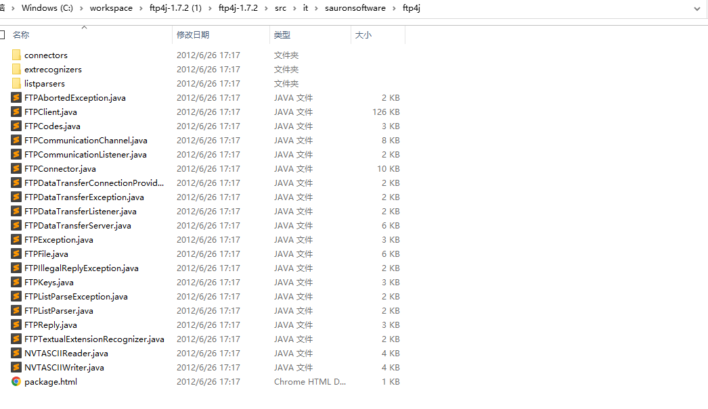
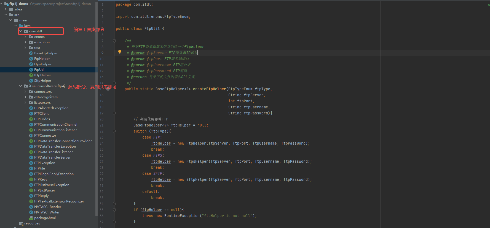

# Java实现FTP(S)/SFTP实现文件上传下载

很多时候我们会遇到从FTP上上传和下载文件，但是FTP分为了三种主要实现，分别是FTP，FTPS，SFTP。我们封装一个一套工具类来实现它的连接，上传下载的等功能。

# 1、概念简介

## 1.1、什么是FTP？

FTP是FileTransferProtocol（文件传输协议）的英文简称，而中文简称为“文传协议”。用于Internet上的控制文件的双向传输。 

同时，它也是一个应用程序（Application）。基于不同的操作系统有不同的FTP应用程序，而所有这些应用程序都遵守同一种协议以传输文件。

在FTP的使用当中，用户经常遇到两个概念："下载"（Download）和"上传"（Upload）。

"下载"文件就是从远程主机拷贝文件至自己的计算机上；"上传"文件就是将文件从自己的计算机中拷贝至远程主机上。

用Internet语言来说，用户可通过客户机程序向（从）远程主机上传（下载）文件。

## 1.2、什么是FTPS？

FTPS是一种对常用的文件传输协议（FTP）添加传输层安全（TLS）和安全套接层（SSL）加密协议支持的扩展协议。

FTPS不应与基于SSH的SSH文件传输协议或是Secure FTP协议相混淆。

换句话说，就是FTP的扩展，添加了加密操作。

## 1.3、什么是SFTP？

SFTP（sftp）一般指SSH文件传输协议。

在计算机领域，SSH文件传输协议（英语：SSH File Transfer Protocol，也称Secret File Transfer Protocol，中文：安全文件传送协议，英文：Secure FTP或字母缩写：SFTP）是一数据流连接，提供文件访问、传输和管理功能的网络传输协议。

## 1.4、概念小结

通俗的讲，FTP,FTPS 属于同一种协议的远程文件管理系统。FTPS是在FTP的基础上添加了安全层，需要我们使用软件安装。SFTP是基于SSH协议，我们SSH开启，并且开启了22端口，就可以直接连接进行文件管理。

# 2、依赖包准备

FTP和FTPS我们选用ftp4j来实现文件管理，SFTP我们使用jsch来实现文件管理。

```xml
<dependencies>
    <dependency>
        <groupId>org.apache.commons</groupId>
        <artifactId>commons-lang3</artifactId>
        <version>3.12.0</version>
    </dependency>

    <!--连接SFTP-->
    <dependency>
        <groupId>com.jcraft</groupId>
        <artifactId>jsch</artifactId>
        <version>0.1.54</version>
    </dependency>
</dependencies>
```

ftp4j可能在maven中央仓库不存在，这里提供一个官方链接去下载源码，打入自己的nexus私服即可。

ftp4j下载地址：http://www.sauronsoftware.it/projects/ftp4j/download.php

下载后的源码拷贝到您的项目，结构如下：



因为我们采用直接拷贝源码方式集成到项目，所以如同如下结构：



# 3、工具类实现

## 3.1、定义FTP统一接口IFtpHelper

定义了一些FTP的基本操作，获取FTP客户端，获取根目录，连接FTP服务器，切换目录，遍历目录，断开连接，检查目录是否存在，下载文件，上传文件，删除文件等操作。

```java
/**
 * FTP操作统一接口
 */
public interface IFtpHelper<T> {

    /**
     * 获取客户端
     * @return 客户端 FTP(S)对应FtpClient, SFTP对应ChannelSftp
     */
    T getClient();


    /**
     * 获取FTP/FTPS/SFTP所处根目录
     * @return 根目录
     */
    String getRootPath();


    /**
     * 创建连接
     * @param ftpServer FTP服务器IP
     * @param ftpPort FTP服务器端口
     * @param ftpUsername FTP连接用户名
     * @param ftpPassword FTP连接密码
     */
    void connect(String ftpServer, int ftpPort, String ftpUsername, String ftpPassword);

    /**
     * 检查目录是否存在
     * @param dirName 目录名称
     */
    boolean checkDirectory(String dirName);


    /**
     * 根据上级目录列出下级目录的名称列表
     * @param dir 上级目录名称
     * @return 下级目录名称列表
     */
    String[] listDir(String dir);

    /**
     * 断开连接
     */
    void disconnect();

    /**
     * 切换目录
     * @param path 目录path
     * @throws Exception
     */
    void changeDirectory(String path);

    /**
     * 下载文件到输出流
     * @param filePath 文件路径
     * @return 输出流（没有关闭，需要调用者自己关闭）
     * @throws Exception
     */
    OutputStream downloadFile(String filePath) throws Exception;

    /**
     * 上传文件
     * @param file 要上传的本地文件
     * @param filePath 上传到FTP服务的所在目录
     * @throws Exception
     */
    void uploadFile(File file, String filePath) throws Exception;

    /**
     * 删除远程FTP文件
     * @param filePath 远程FTP文件目录
     * @throws Exception
     */
    void deleteFile(String filePath) throws Exception;
}
```

## 3.2、使用模板方法抽象类定义模板

实现了一些公共的方法，比如获取客户端（通过泛型），获取根目录路径等。

```java
/**
 * Ftp 工具类 基础父类
 */
public abstract class BaseFtpHelper<T> implements IFtpHelper<T> {

    /**
     * 客户端（FTP/FTPS/SFTP）
     */
    protected T ftp;

    /**
     * 根目录
     */
    protected String rootPath;


    /**
     * 初始化Ftp信息
     * @param ftpServer   ftp服务器地址
     * @param ftpPort     Ftp端口号
     * @param ftpUsername ftp 用户名
     * @param ftpPassword ftp 密码
     */
    public BaseFtpHelper(String ftpServer, int ftpPort, String ftpUsername,
                     String ftpPassword) {
        connect(ftpServer, ftpPort, ftpUsername, ftpPassword);
    }


    /**
     * 将文件路径替换为一个正确的路径 windows不处理
     * @param path 文件路径
     */
    public static String replaceFilePath(String path){
        if (StringUtils.isBlank(path)){
            return "";
        }

        if (path.trim().equals("/")){
            return path.trim();
        }

        // 反斜杠转正  双正斜杠去重
        path = path.replaceAll("\\\\", "/");
        while (path.contains("//")){
            path = path.replaceAll("//", "/");
        }

        if (path.endsWith("/")){
            return path.substring(0, path.length() - 1);
        }

        return path;
    }


    @Override
    public T getClient() {
        return ftp;
    }

    @Override
    public String getRootPath() {
        return rootPath;
    }
}
```

## 3.3、FTP工具类实现

```java
/**
 * Ftp 工具类
 */
public class FtpHelper extends BaseFtpHelper<FTPClient>{
    /**
     * 初始化Ftp信息
     *
     * @param ftpServer   ftp服务器地址
     * @param ftpPort     Ftp端口号
     * @param ftpUsername ftp 用户名
     * @param ftpPassword ftp 密码
     */
    public FtpHelper(String ftpServer, int ftpPort, String ftpUsername,
                     String ftpPassword) {
        super(ftpServer, ftpPort, ftpUsername, ftpPassword);
    }

    /**
     * 连接到ftp
     * @param ftpServer   ftp服务器地址
     * @param ftpPort     Ftp端口号
     * @param ftpUsername ftp 用户名
     * @param ftpPassword ftp 密码
     */
    public void connect(String ftpServer, int ftpPort, String ftpUsername, String ftpPassword) {
        ftp = new FTPClient();
        try {
            ftp.connect(ftpServer, ftpPort);
            ftp.login(ftpUsername, ftpPassword);
            ftp.setCharset("UTF-8");
            // 记录根目录
            this.rootPath = ftp.currentDirectory();
            System.out.println(this.rootPath);
        }
        catch (Exception e) {
            ftp =  null;
            throw new FtpException(e.getMessage(), e.getCause());
        }
    }

    /**
     * 更改ftp路径
     * @param dirName
     * @return
     */
    public boolean checkDirectory(String dirName) {
        boolean flag;
        try {
            ftp.changeDirectory(dirName);
            flag = true;
        } catch (Exception e) {
            flag = false;
        }
        return flag;
    }


    /**
     * 遍历目录
     * @param dir 目录名称
     * @return 子目录列表
     */
    public String[] listDir(String dir){
        // 不是目录，则直接返回, 校验的同时会进入目录
        if (!checkDirectory(dir)){
            return new String[]{};
        }
        // 查询目录下面有什么
        String[] dirs = new String[]{};
        try {
            dirs = ftp.listNames();
        } catch (Exception e) {
            e.printStackTrace();
        }
        return dirs;
    }


    /**
     * 断开ftp链接
     */
    public void disconnect() {
        try {
            if (ftp.isConnected()) {
                ftp.disconnect(true);
            }
        } catch (Exception e) {
            e.printStackTrace();
        }
    }

    /**
     * 读取ftp文件流
     *
     * @param filePath ftp文件路径
     * @return s
     * @throws Exception
     */
    public OutputStream downloadFile(String filePath) throws Exception {
        OutputStream outputStream = new ByteArrayOutputStream();
        String fileName = "";
        filePath = StringUtils.removeStart(filePath, "/");
        int len = filePath.lastIndexOf("/");
        if (len == -1) {
            if (filePath.length() > 0) {
                fileName = filePath;
            } else {
                throw new Exception("没有输入文件路径");
            }
        } else {
            fileName = filePath.substring(len + 1);
            String type = filePath.substring(0, len);
            String rootStart = rootPath;
            rootStart = StringUtils.removeStart(rootStart, "/");
            if (type.startsWith(rootStart)){
                type = type.substring(rootStart.length() + 1);
            }
            String[] typeArray = type.split("/");
            // 先切换到根目录，预防出错
            ftp.changeDirectory(rootPath);
            for (String s : typeArray) {
                ftp.changeDirectory(s);
            }
        }
        try {
            final String pwd = ftp.currentDirectory();
            ftp.download(fileName, outputStream, 0, null);
        } catch (Exception e) {
            e.printStackTrace();
        }
        return outputStream;
    }

    /**
     * 上传文件到ftp
     *
     * @param file     文件对象
     * @param filePath 上传的路径
     * @throws Exception
     */
    public void uploadFile(File file, String filePath) throws Exception {
        InputStream inStream = new FileInputStream(file);
        uploadFile(inStream, filePath);
    }

    /**
     * 上传文件到ftp
     *
     * @param inStream 上传的文件流
     * @param filePath 上传路径
     * @throws Exception
     */
    public void uploadFile(InputStream inStream, String filePath)
            throws Exception {
        if (inStream == null) {
            return;
        }
        String fileName = "";
        filePath = StringUtils.removeStart(filePath, "/");
        int len = filePath.lastIndexOf("/");
        if (len == -1) {
            if (filePath.length() > 0) {
                fileName = filePath;
            } else {
                throw new Exception("没有输入文件路径");
            }
        } else {
            fileName = filePath.substring(len + 1);
            String type = filePath.substring(0, len);
            String rootStart = rootPath;
            rootStart = StringUtils.removeStart(rootStart, "/");
            if (type.startsWith(rootStart)){
                type = type.substring(rootStart.length() + 1);
            }
            String[] typeArray = type.split("/");
            // 先切换到根目录，预防出错
            ftp.changeDirectory(rootPath);
            for (String s : typeArray) {
                if (!checkDirectory(s)) {
                    ftp.createDirectory(s);
                }
            }
        }
        ftp.upload(fileName, inStream, 0, 0, null);
    }

    /**
     * 删除ftp文件
     *
     * @param filePath 文件路径
     * @throws Exception
     */
    public void deleteFile(String filePath) throws Exception {
        String fileName = "";
        filePath = StringUtils.removeStart(filePath, "/");
        int len = filePath.lastIndexOf("/");
        if (len == -1) {
            if (filePath.length() > 0) {
                fileName = filePath;
            } else {
                throw new Exception("没有输入文件路径");
            }
        } else {
            fileName = filePath.substring(len + 1);

            String type = filePath.substring(0, len);
            String[] typeArray = type.split("/");
            for (String s : typeArray) {
                if (checkDirectory(s)) {
                    ftp.changeDirectory(s);
                }
            }
        }
        ftp.deleteFile(fileName);
    }

    /**
     * 切换目录
     *
     * @param path
     * @throws Exception
     */
    public void changeDirectory(String path) {
        if (!StringUtils.isEmpty(path)) {
            try {
                ftp.changeDirectory(path);
            } catch (Exception e) {
                e.printStackTrace();
            }
        }
    }
}
```

## 3.4、FTPS工具类实

```java
import com.itdl.exception.FtpException;
import it.sauronsoftware.ftp4j.FTPClient;
import org.apache.commons.lang3.StringUtils;

import javax.net.ssl.SSLContext;
import javax.net.ssl.SSLSocketFactory;
import javax.net.ssl.TrustManager;
import javax.net.ssl.X509TrustManager;
import java.io.*;
import java.security.SecureRandom;
import java.security.cert.X509Certificate;

/**
 * Ftps 工具类
 */
public class FtpsHelper extends BaseFtpHelper<FTPClient>{
    /**
     * 初始化Ftp信息
     *
     * @param ftpServer   ftp服务器地址
     * @param ftpPort     Ftp端口号
     * @param ftpUsername ftp 用户名
     * @param ftpPassword ftp 密码
     */
    public FtpsHelper(String ftpServer, int ftpPort, String ftpUsername,
                      String ftpPassword) {
        super(ftpServer, ftpPort, ftpUsername, ftpPassword);
    }

    /**
     * 连接到ftp
     * @param ftpServer   ftp服务器地址
     * @param ftpPort     Ftp端口号
     * @param ftpUsername ftp 用户名
     * @param ftpPassword ftp 密码
     */
    public void connect(String ftpServer, int ftpPort, String ftpUsername, String ftpPassword) {
        ftp = new FTPClient();
        try {
            TrustManager[] trustManager = new TrustManager[]{new X509TrustManager() {
                public X509Certificate[] getAcceptedIssuers() {
                    return null;
                }
                public void checkClientTrusted(X509Certificate[] certs,
                                               String authType) {
                }
                public void checkServerTrusted(X509Certificate[] certs,
                                               String authType) {
                }
            }};
            SSLContext sslContext = null;
            sslContext = SSLContext.getInstance("SSL");
            sslContext.init(null, trustManager, new SecureRandom());
            SSLSocketFactory sslSocketFactory = sslContext.getSocketFactory();
            ftp.setSSLSocketFactory(sslSocketFactory);
            ftp.setSecurity(FTPClient.SECURITY_FTPES);
            ftp.connect(ftpServer, ftpPort);
            ftp.login(ftpUsername, ftpPassword);
            ftp.setCharset("UTF-8");
            // 记录根目录
            this.rootPath = ftp.currentDirectory();
            System.out.println(this.rootPath);
        }
        catch (Exception e) {
            ftp =  null;
            throw new FtpException(e.getMessage(), e.getCause());
        }
    }

    /**
     * 更改ftp路径
     * @param dirName
     * @return
     */
    public boolean checkDirectory(String dirName) {
        boolean flag;
        try {
            ftp.changeDirectory(dirName);
            flag = true;
        } catch (Exception e) {
            flag = false;
        }
        return flag;
    }


    /**
     * 遍历目录
     * @param dir 目录名称
     * @return 子目录列表
     */
    public String[] listDir(String dir){
        // 不是目录，则直接返回, 校验的同时会进入目录
        if (!checkDirectory(dir)){
            return new String[]{};
        }
        // 查询目录下面有什么
        String[] dirs = new String[]{};
        try {
            dirs = ftp.listNames();
        } catch (Exception e) {
            e.printStackTrace();
        }
        return dirs;
    }


    /**
     * 断开ftp链接
     */
    public void disconnect() {
        try {
            if (ftp.isConnected()) {
                ftp.disconnect(true);
            }
        } catch (Exception e) {
            e.printStackTrace();
        }
    }

    /**
     * 读取ftp文件流
     *
     * @param filePath ftp文件路径
     * @return s
     * @throws Exception
     */
    public OutputStream downloadFile(String filePath) throws Exception {
        OutputStream outputStream = new ByteArrayOutputStream();
        String fileName = "";
        filePath = StringUtils.removeStart(filePath, "/");
        int len = filePath.lastIndexOf("/");
        if (len == -1) {
            if (filePath.length() > 0) {
                fileName = filePath;
            } else {
                throw new Exception("没有输入文件路径");
            }
        } else {
            fileName = filePath.substring(len + 1);
            String type = filePath.substring(0, len);
            String rootStart = rootPath;
            rootStart = StringUtils.removeStart(rootStart, "/");
            if (type.startsWith(rootStart)){
                type = type.substring(rootStart.length() + 1);
            }
            String[] typeArray = type.split("/");
            // 先切换到根目录，预防出错
            ftp.changeDirectory(rootPath);
            for (String s : typeArray) {
                ftp.changeDirectory(s);
            }
        }
        try {
            final String pwd = ftp.currentDirectory();
            ftp.download(fileName, outputStream, 0, null);
        } catch (Exception e) {
            e.printStackTrace();
        }
        return outputStream;
    }

    /**
     * 上传文件到ftp
     *
     * @param file     文件对象
     * @param filePath 上传的路径
     * @throws Exception
     */
    public void uploadFile(File file, String filePath) throws Exception {
        InputStream inStream = new FileInputStream(file);
        uploadFile(inStream, filePath);
    }

    /**
     * 上传文件到ftp
     *
     * @param inStream 上传的文件流
     * @param filePath 上传路径
     * @throws Exception
     */
    public void uploadFile(InputStream inStream, String filePath)
            throws Exception {
        if (inStream == null) {
            return;
        }
        String fileName = "";
        filePath = StringUtils.removeStart(filePath, "/");
        int len = filePath.lastIndexOf("/");
        if (len == -1) {
            if (filePath.length() > 0) {
                fileName = filePath;
            } else {
                throw new Exception("没有输入文件路径");
            }
        } else {
            fileName = filePath.substring(len + 1);
            String type = filePath.substring(0, len);
            String rootStart = rootPath;
            rootStart = StringUtils.removeStart(rootStart, "/");
            if (type.startsWith(rootStart)){
                type = type.substring(rootStart.length() + 1);
            }
            String[] typeArray = type.split("/");
            // 先切换到根目录，预防出错
            ftp.changeDirectory(rootPath);
            for (String s : typeArray) {
                if (!checkDirectory(s)) {
                    ftp.createDirectory(s);
                }
            }
        }
        ftp.upload(fileName, inStream, 0, 0, null);
    }

    /**
     * 删除ftp文件
     *
     * @param filePath 文件路径
     * @throws Exception
     */
    public void deleteFile(String filePath) throws Exception {
        String fileName = "";
        filePath = StringUtils.removeStart(filePath, "/");
        int len = filePath.lastIndexOf("/");
        if (len == -1) {
            if (filePath.length() > 0) {
                fileName = filePath;
            } else {
                throw new Exception("没有输入文件路径");
            }
        } else {
            fileName = filePath.substring(len + 1);

            String type = filePath.substring(0, len);
            String[] typeArray = type.split("/");
            for (String s : typeArray) {
                if (checkDirectory(s)) {
                    ftp.changeDirectory(s);
                }
            }
        }
        ftp.deleteFile(fileName);
    }

    /**
     * 切换目录
     *
     * @param path
     * @throws Exception
     */
    public void changeDirectory(String path) {
        if (!StringUtils.isEmpty(path)) {
            try {
                ftp.changeDirectory(path);
            } catch (Exception e) {
                e.printStackTrace();
            }
        }
    }
}
```

## 3.5、SFTP工具类实现

```java
import com.itdl.exception.FtpException;
import com.jcraft.jsch.*;
import org.apache.commons.lang3.StringUtils;

import java.io.*;
import java.util.*;
import java.util.stream.Collectors;

/**
 * SFTP 工具类
 */
public class SftpHelper extends BaseFtpHelper<ChannelSftp>{
    /**
     * 初始化Ftp信息
     *
     * @param ftpServer   ftp服务器地址
     * @param ftpPort     Ftp端口号
     * @param ftpUsername ftp 用户名
     * @param ftpPassword ftp 密码
     */
    public SftpHelper(String ftpServer, int ftpPort, String ftpUsername,
                      String ftpPassword) {
        super(ftpServer, ftpPort, ftpUsername, ftpPassword);
    }

    /**
     * 连接到ftp
     *
     * @param ftpServer   ftp服务器地址
     * @param ftpPort     Ftp端口号
     * @param ftpUsername ftp 用户名
     * @param ftpPassword ftp 密码
     */
    public void connect(String ftpServer, int ftpPort, String ftpUsername, String ftpPassword) {
        ftp = new ChannelSftp();
        try {
            JSch jsch = new JSch();
            // 获取session
            Session session = jsch.getSession(ftpUsername, ftpServer, ftpPort);
            // 设置密码
            if (!StringUtils.isEmpty(ftpPassword)){
                session.setPassword(ftpPassword);
            }
            Properties properties = new Properties();
            properties.put("StrictHostKeyChecking", "no");
            session.setConfig(properties);
            // 使用会话开启连接
            if (!session.isConnected()){
                session.connect(30000);
            }
            Channel channel = session.openChannel("sftp");
            if (!channel.isConnected()){
                channel.connect(30000);
            }
            ftp = (ChannelSftp) channel;
            // 记录根目录
            this.rootPath = ftp.pwd();
        }
        catch (Exception e) {
            ftp = null;
            throw new FtpException(e.getMessage(), e.getCause());
        }
    }

    /**
     * 更改ftp路径
     *
     * @param dirName
     * @return
     */
    public boolean checkDirectory(String dirName) {
        boolean flag;
        try {
            ftp.cd(dirName);
            flag = true;
        } catch (Exception e) {
            e.printStackTrace();
            flag = false;
        }
        return flag;
    }


    /**
     * 遍历目录
     * @param dir 目录名称
     * @return 子目录列表
     */
    public String[] listDir(String dir){
        // 不是目录，则直接返回, 校验的同时会进入目录
        if (!checkDirectory(dir)){
            return new String[]{};
        }
        // 查询目录下面有什么
        String[] dirs = new String[]{};
        try {
            final Vector<ChannelSftp.LsEntry> result = (Vector<ChannelSftp.LsEntry>) ftp.ls(dir);
            // 转换为string数组
            return result.stream().map(ChannelSftp.LsEntry::getFilename).collect(Collectors.toList()).toArray(new String[]{});
        } catch (Exception e) {
            e.printStackTrace();
        }
        return dirs;
    }


    /**
     * 断开ftp链接
     */
    public void disconnect() {
        try {
            if (ftp.isConnected()) {
                ftp.getSession().disconnect();
                ftp.disconnect();
                ftp.quit();
            }
        } catch (Exception e) {
            e.printStackTrace();
        }
    }

    /**
     * 读取ftp文件流
     *
     * @param filePath ftp文件路径
     * @return s
     * @throws Exception
     */
    public OutputStream downloadFile(String filePath) throws Exception {
        InputStream inputStream = null;
        String fileName = "";
        filePath = StringUtils.removeStart(filePath, "/");
        int len = filePath.lastIndexOf("/");
        if (len == -1) {
            if (filePath.length() > 0) {
                fileName = filePath;
            } else {
                throw new Exception("没有输入文件路径");
            }
        } else {
            fileName = filePath.substring(len + 1);
            String type = filePath.substring(0, len);
            String rootStart = rootPath;
            rootStart = StringUtils.removeStart(rootStart, "/");
            if (type.startsWith(rootStart) && !rootPath.equals("/")){
                type = type.substring(rootStart.length() + 1);
            }
            String[] typeArray = type.split("/");
            // 先切换到根目录，预防出错
            ftp.cd(rootPath);
            for (String s : typeArray) {
                ftp.cd(s);
            }
        }
        try {
            final String pwd = ftp.pwd();
            inputStream = ftp.get(fileName);
            ByteArrayOutputStream outputStream = new ByteArrayOutputStream();//输出流
            byte[] bytes = new byte[1024];
            int outlen;
            while ((outlen = inputStream.read(bytes)) != -1) {
                outputStream.write(bytes, 0, outlen); //将读到的字节写入输出流
            }
            return outputStream;
        } catch (Exception e) {
            e.printStackTrace();
            throw new RuntimeException("download file fail");
        }
    }

    /**
     * 上传文件到ftp
     *
     * @param file     文件对象
     * @param filePath 上传的路径
     * @throws Exception
     */
    public void uploadFile(File file, String filePath) throws Exception {
        InputStream inStream = new FileInputStream(file);
        uploadFile(inStream, filePath);
    }

    /**
     * 上传文件到ftp
     *
     * @param inStream 上传的文件流
     * @param filePath 上传路径
     * @throws Exception
     */
    public void uploadFile(InputStream inStream, String filePath)
            throws Exception {
        if (inStream == null) {
            return;
        }
        String fileName = "";
        filePath = StringUtils.removeStart(filePath, "/");
        int len = filePath.lastIndexOf("/");
        if (len == -1) {
            if (filePath.length() > 0) {
                fileName = filePath;
            } else {
                throw new Exception("没有输入文件路径");
            }
        } else {
            fileName = filePath.substring(len + 1);
            String type = filePath.substring(0, len);
            String[] typeArray = type.split("/");
            for (String s : typeArray) {
                if (!checkDirectory(s)) {
                    ftp.mkdir(s);
                }
            }
        }
        ftp.put(inStream, fileName);
    }

    /**
     * 删除ftp文件
     *
     * @param filePath 文件路径
     * @throws Exception
     */
    public void deleteFile(String filePath) throws Exception {
        String fileName = "";
        filePath = StringUtils.removeStart(filePath, "/");
        int len = filePath.lastIndexOf("/");
        if (len == -1) {
            if (filePath.length() > 0) {
                fileName = filePath;
            } else {
                throw new Exception("没有输入文件路径");
            }
        } else {
            fileName = filePath.substring(len + 1);

            String type = filePath.substring(0, len);
            String[] typeArray = type.split("/");
            for (String s : typeArray) {
                if (checkDirectory(s)) {
                    ftp.cd(s);
                }
            }
        }
        ftp.rm(fileName);
    }

    /**
     * 切换目录
     *
     * @param path
     * @throws Exception
     */
    public void changeDirectory(String path) {
        if (!StringUtils.isEmpty(path)) {
            try {
                ftp.cd(path);
            } catch (Exception e) {
                e.printStackTrace();
            }
        }
    }
}
```

## 3.6、FTP统一入口工具类实现

```java
/**
 * FTP对外工具类
 */
public class FtpUtil {

    /**
     * 根据FTP类型和基本信息创建一个FtpHelper
     * @param ftpServer FTP服务器IP地址
     * @param ftpPort FTP服务器端口
     * @param ftpUsername FTP用户名
     * @param ftpPassword FTP密码
     * @return 目录下的文件列表和DDL关系
     */
    public static BaseFtpHelper<?> createFtpHelper(FtpTypeEnum ftpType,
                                                   String ftpServer,
                                                   int ftpPort,
                                                   String ftpUsername,
                                                   String ftpPassword){
        // 判断使用哪种FTP
        BaseFtpHelper<?> ftpHelper = null;
        switch (ftpType){
            case FTP:
                ftpHelper = new FtpHelper(ftpServer, ftpPort, ftpUsername, ftpPassword);
                break;
            case FTPS:
                ftpHelper = new FtpsHelper(ftpServer, ftpPort, ftpUsername, ftpPassword);
                break;
            case SFTP:
                ftpHelper = new SftpHelper(ftpServer, ftpPort, ftpUsername, ftpPassword);
                break;
            default:
                break;
        }
        if (ftpHelper == null){
            throw new RuntimeException("ftpHelper is not null");
        }

        return ftpHelper;
    }

}
```

## 3.7、文件上传测试

```java
import com.itdl.BaseFtpHelper;
import com.itdl.FtpUtil;
import com.itdl.enums.FtpTypeEnum;

import java.io.File;

/**
 * FTP/FTPS/SFTP文件下载测试
 */
public class FtpUtilUploadTest {

    public static void main(String[] args) throws Exception {
        // 测试连接FTP
        final BaseFtpHelper<?> ftpHelper = FtpUtil.createFtpHelper(FtpTypeEnum.FTP, "FTP地址", 21, "账号", "密码");
        ftpHelper.uploadFile(new File("C:\\workspace\\测试文件.txt"), "上传路径/测试文件.txt");

        // 测试连接FTPS
        final BaseFtpHelper<?> ftpsHelper = FtpUtil.createFtpHelper(FtpTypeEnum.FTPS, "FTPS地址", 21, "账号", "密码");
        ftpsHelper.uploadFile(new File("C:\\workspace\\测试文件.txt"), "上传路径/测试文件.txt");

        // 测试连接SFTP
        final BaseFtpHelper<?> sftpHelper = FtpUtil.createFtpHelper(FtpTypeEnum.SFTP, "SFTP地址", 22, "账号", "密码");
        sftpHelper.uploadFile(new File("C:\\workspace\\测试文件.txt"), "上传路径/10m/测试文件.txt");

        // 用完之后一定要关闭连接
        ftpHelper.disconnect();
        ftpsHelper.disconnect();
        sftpHelper.disconnect();
    }

}
```

## 3.8、文件下载测试

```java
import com.itdl.BaseFtpHelper;
import com.itdl.FtpUtil;
import com.itdl.enums.FtpTypeEnum;

import java.io.OutputStream;

/**
 * FTP/FTPS/SFTP文件下载测试
 */
public class FtpUtilDownloadTest {

    public static void main(String[] args) throws Exception {
        // 测试连接FTP
        final BaseFtpHelper<?> ftpHelper = FtpUtil.createFtpHelper(FtpTypeEnum.FTP, "FTP地址", 21, "账号", "密码");
        try (final OutputStream outputStream = ftpHelper.downloadFile("文件绝对路径")){
            System.out.println(outputStream.toString().length());
        }

        // 测试连接FTPS
        final BaseFtpHelper<?> ftpsHelper = FtpUtil.createFtpHelper(FtpTypeEnum.FTPS, "FTPS地址", 21, "账号", "密码");
        try (final OutputStream outputStream = ftpsHelper.downloadFile("文件绝对路径")){
            System.out.println(outputStream.toString().length());
        }

        // 测试连接SFTP
        final BaseFtpHelper<?> sftpHelper = FtpUtil.createFtpHelper(FtpTypeEnum.SFTP, "SFTP地址", 22, "账号", "密码");
        try (final OutputStream outputStream = sftpHelper.downloadFile("文件绝对路径")){
            System.out.println(outputStream.toString().length());
        }

        // 用完之后一定要关闭连接
        ftpHelper.disconnect();
        ftpsHelper.disconnect();
        sftpHelper.disconnect();
    }

}
```

# 4、小结

FTP,FTPS，SFTP文件上传下载都已经实现了，开始您的FTP旅途吧！


